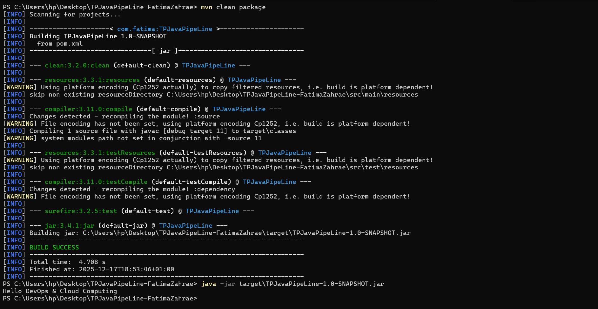
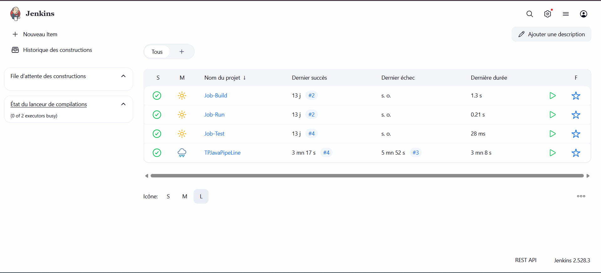
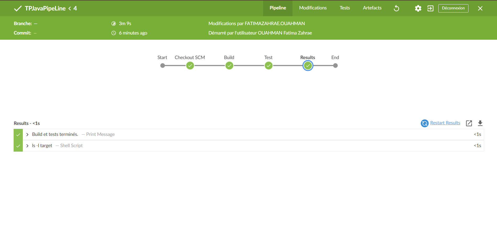
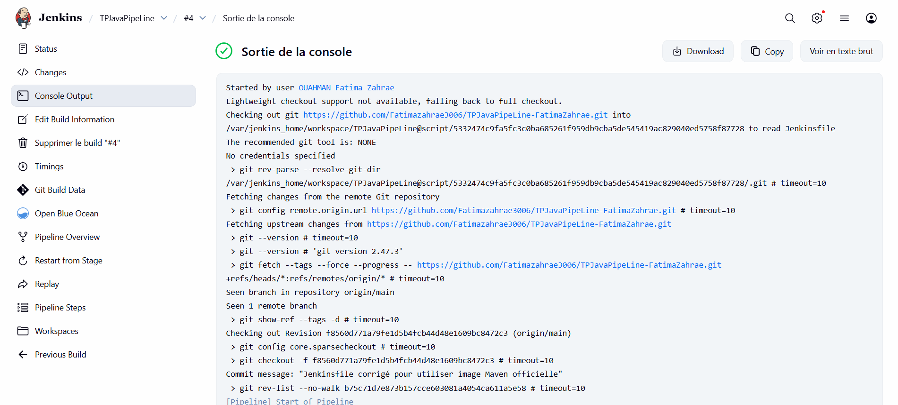

# TP Java Pipeline - Fatima Zahrae

## Description
Ce projet illustre la mise en place d’un pipeline Jenkins pour un projet Java Maven.  
L’objectif est de montrer l’automatisation du build, des tests et de l’exécution de l’application via Jenkins et Docker.

---

## Contenu du dépôt
- `src/` : code source Java
- `target/` : jar compilé et fichiers Maven
- `Jenkinsfile` : pipeline Jenkins
- `images/` : captures pour le README
- `README.md` : ce fichier

---

## Prérequis
- Docker installé et configuré
- Jenkins Blue Ocean
- Maven 3.x
- Java 11

---

## Étapes du pipeline Jenkins

1️⃣ **Checkout** :  
Le code est cloné depuis le dépôt GitHub.

2️⃣ **Build** :  
Compilation Maven, exécution des tests et création du fichier JAR.

3️⃣ **Run** :  
Exécution du JAR pour afficher le message `Hello DevOps & Cloud Computing`.

4️⃣ **Blue Ocean** :  
Visualisation des stages du pipeline.

---

## Captures du projet

### 1️⃣ Exécution du JAR

### 2️⃣ UI Jenkins

### 3️⃣ Pipeline Blue Ocean

### 4️⃣ Sortie console du job

---

## Conclusion
Le pipeline est fonctionnel, le projet compile sans erreur et l’exécution du JAR est conforme.  
Toutes les étapes sont visibles via Jenkins UI et Blue Ocean.
